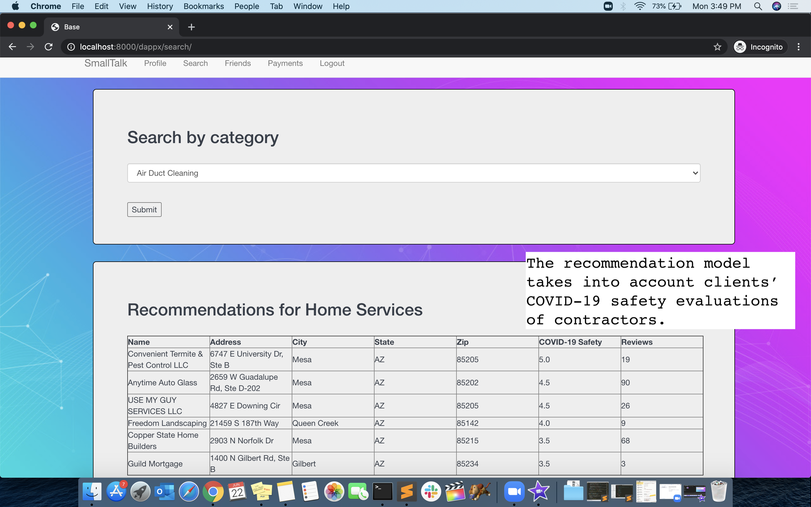
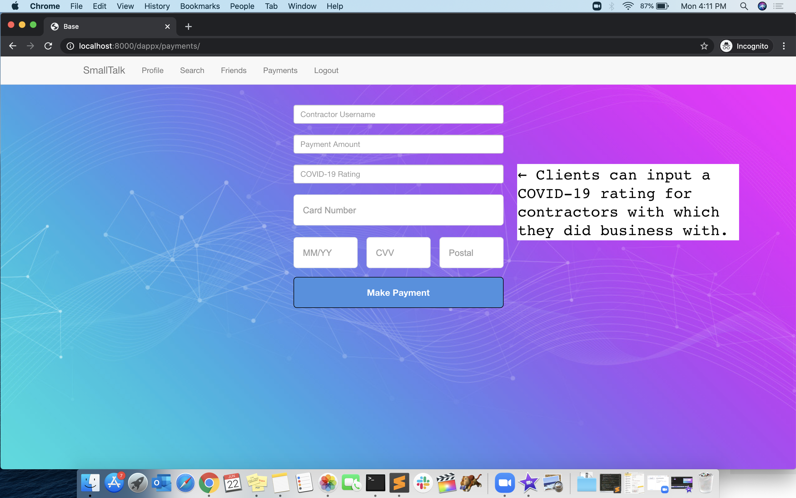
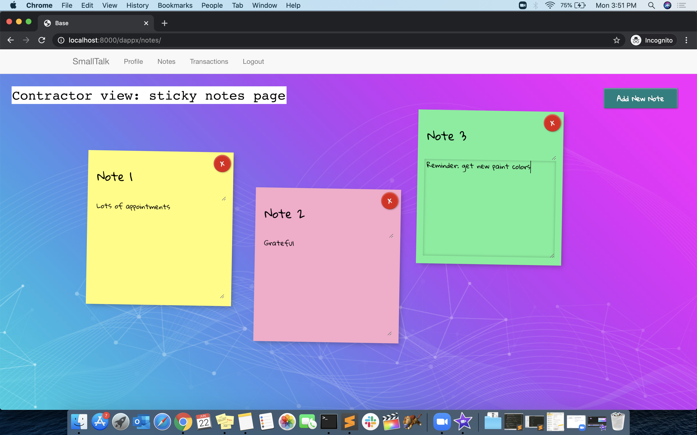
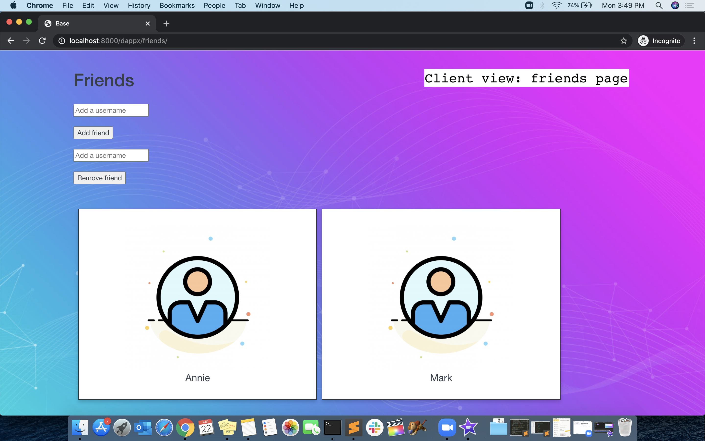

# summer-hackathon
SmallTalk is a service aiding small businesses in gaining publicity, particularly in response to the coronavirus pandemic. We provide a recommendation service for home services, including COVID-19 safety ratings as a feature, on the side of the client, giving greater weight to contractors and small business service-providers who were given positive ratings provided by friends. Clients are able to search for contractors, receive recommendations, and pay and rate contractors on the website. On the side of the contractors, we provide a note-taking interface and transaction log, along with a profile page to update categories of service. We built the backend with Django and the frontend with HTML, CSS, and JavaScript. We also incorporated the Square Payments API.

## Download data
* Clone the repository
* Download the [Yelp dataset](https://www.yelp.com/dataset) for business reviews, reviews, and user data 
* Run `data_preparation.ipynb` to isolate business and review data associated with home services (`yelp_network_data.csv`)
* Run `user_friendships.ipynb` to isolate client (Yelp users) and contractor (small businesses) data (`client_data.csv` and `contractor_data.csv`)
* Place `client_data.csv` and `contractor_data.csv` in the `djangox/dprojx` directory
* Place `yelp_network_data.csv` in the `djangox/dprojx/dappx/data` directory 

## Run locally
* Install Django
* Run `pip install squareup` to install Square's Python SDK
* Run `python manage.py makemigrations`
* Run `python manage.py migrate`
* Run `python manage.py shell`, followed by `exec(open('data.py').read())` and `exec(open('data2.py').read())`
* Run `python manage.py runserver` to start the application
* Navigate to `localhost:8000` to see the service in action

## Screenshots

  
  
  
  

